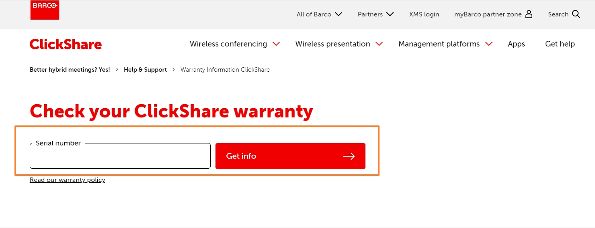

# Barco_ClickShare_Assignment
This is for testing Barco web page > ClickShare Warranty input feature in web. And for all automation test cases could seperate different part as below and reference `Test Plan` folder:
1. **End 2 End Testing**
2. **Function Testing**
3. **L10N Testing**
4. **Browser Testing - Firefox**
5. **Browser Testing - Edge**

***Automation methodology***:
I use the **python selenium** + **browser driver** + **beautifulReport**, so if you would like to run the automation case, please follow below steps to accomplish. Finally, I also put the `result report` and `recording` of running case process, if any question, please contact with me, thank you!

<h4 align="center">
  
</h4>

## Demo - recording


https://user-images.githubusercontent.com/6802038/168200312-d1426b1d-89e0-48cb-a4d7-4cd6ef9fdc2a.mp4


### Table of Contents
**[Pre-requirement](#pre-requirement)**<br>
**[Installation steps - python selenium](#installation-steps---python-selenium)**<br>
**[Installation steps - browser driver](#installation-steps---browser-driver)**<br>
**[Installation steps - beautifulReport](#installation-steps---beautifulreport)**<br>
**[Usage - how to run my test case](#usage---how-to-run-my-test-case)**<br>
**[Reference](#reference)**<br>


## Pre-requirement
1. [Python 3.10.4](https://www.python.org/downloads/)
2. [Python Selenium](https://selenium-python.readthedocs.io/installation.html)
3. [Web driver (Chrome, Firefox, Edge)](https://selenium-python.readthedocs.io/installation.html#drivers)
4. [BeautifulReport](https://github.com/TesterlifeRaymond/BeautifulReport)

Or you could see also [Python Selenium with VSCODE 教學筆記](https://hackmd.io/@FortesHuang/S1V6jrvet)
## Installation steps - python selenium
**My environment : win10**
So I would introduce how to install in win10 env.

Make sure your env installed `Python 3.9 or above` version, and open **cmd** and run
```
$ pip install selenium
```
    


And after see ***Successfully installed selenium*** means you install already!

## Installation steps - browser driver
### Chrome driver ###
Automation need browser driver to control event, so need your **chrome version and compiable version of driver**. And if you don't know your chrome version, could use `chrome://settings/help` to check


[**Download Chrome WebDriver**](https://chromedriver.chromium.org/downloads)


**Note :** WebDriver save path，suggest to put on the same folder with python execuation folder, and it would be no other issue when running, example: if your python install on path like `C:\Users\你的使用者名稱\AppData\Local\Programs\Python\Python39`, and suggest put the driver in the same folder here.


### Firefox driver ###
The same, you need check your firefox version first, and download compatiable driver version
[**Download Firefox WebDriver**](https://github.com/mozilla/geckodriver/releases)


**Note :** WebDriver save path，suggest to put on the same folder with python execuation folder, and it would be no other issue when running, example: if your python install on path like `C:\Users\你的使用者名稱\AppData\Local\Programs\Python\Python39`, and suggest put the driver in the same folder here.

### Edge driver ###
The same, you need check your Edge version first, and download compatiable driver version
[**Download Edge WebDriver**](https://developer.microsoft.com/en-us/microsoft-edge/tools/webdriver/)


**Note :** WebDriver save path，suggest to put on the same folder with python execuation folder, and it would be no other issue when running, example: if your python install on path like `C:\Users\你的使用者名稱\AppData\Local\Programs\Python\Python39`, and suggest put the driver in the same folder here.

## Installation steps - beautifulReport


**Download and install BeautifulReport**

method1 : clone git repo here
https://github.com/TesterlifeRaymond/BeautifulReport.git

method2 : visit github and download as zip
https://github.com/TesterlifeRaymond/BeautifulReport

After download, unzip the package and rename as `BeautifulReport`


copy `BeautifulReport` all folder into your python > Lib < site-package folder：
`C:\Users\你的使用者名稱\AppData\Local\Programs\Python\Python39\Lib\site-packages\ `

## Usage - how to run my test case

**Step1.** create `auto_test`folder in path `D:\ `      
**Step2.** download all automation python files into `D:\auto_test`
  - Barco_ClickShare_Warranty_E2E_testing.py
  - Barco_ClickShare_Warranty_Edge_testing.py
  - Barco_ClickShare_Warranty_Firefox_testing.py
  - Barco_ClickShare_Warranty_Function_testing.py
  - Barco_ClickShare_Warranty_L10N_testing.py


**Step3.** open cmd console and run
```
python D:\auto_test\Barco_ClickShare_Warranty_E2E_testing.py
```


## Reference
---

